# GUI Integration Plan for Claude Code Chat Extension

## Overview
This document outlines the plan to integrate the advanced React-based GUI from the `gui/` folder into the Claude Code Chat extension while maintaining all existing extension method signatures.

## Architecture Strategy

### 1. Adapter Layer Pattern
Create an adapter layer that translates between the current extension's message format and the GUI's protocol-based system.

```
Extension (unchanged) → Adapter Layer → GUI Components → Webview
```

### 2. Directory Structure
```
src/
├── extension.ts          # Unchanged - maintains all signatures
├── ui.ts                 # Deprecated - will be replaced
├── adapter/              # NEW - Bridge between extension and GUI
│   ├── MessageAdapter.ts # Translates messages
│   ├── StateAdapter.ts   # Maps extension state to Redux
│   └── ProtocolMapper.ts # Protocol conversion utilities
├── webview/              # NEW - GUI integration
│   ├── build/            # Built React app from gui/
│   ├── provider/         # Custom providers for VS Code
│   └── index.html        # Entry point
└── types/                # Shared types
```

## Implementation Phases

### Phase 1: Build System Setup
1. **Create Build Pipeline**
   - Copy gui/ source to a working directory
   - Modify Vite config for VS Code webview constraints
   - Build React app with proper CSP headers
   - Output to `src/webview/build/`

2. **Dependencies**
   - Add build scripts to package.json
   - Ensure all GUI dependencies are dev dependencies
   - Create watch mode for development

### Phase 2: Adapter Layer Implementation

#### MessageAdapter.ts
```typescript
export class MessageAdapter {
  // Converts extension messages to GUI protocol
  static toGuiProtocol(message: ExtensionMessage): GuiProtocolMessage {
    switch (message.type) {
      case 'sendMessage':
        return {
          messageType: 'llm/streamChat',
          messageId: generateId(),
          data: {
            messages: [{
              role: 'user',
              content: message.data.message
            }],
            title: message.data.title
          }
        };
      // ... other conversions
    }
  }

  // Converts GUI protocol to extension format
  static fromGuiProtocol(message: GuiProtocolMessage): ExtensionMessage {
    // Reverse mapping
  }
}
```

#### StateAdapter.ts
```typescript
export class StateAdapter {
  // Maps ClaudeChatProvider state to Redux initial state
  static toReduxState(provider: ClaudeChatProvider): ReduxState {
    return {
      session: {
        id: provider.sessionId,
        title: provider.conversationTitle,
        messages: provider.messages,
        // ... map other state
      },
      config: {
        model: provider.selectedModel,
        // ... map config
      }
    };
  }
}
```

### Phase 3: Extension Integration

#### Minimal Changes to extension.ts
```typescript
// In ClaudeChatProvider.resolveWebviewView
private async resolveWebviewView(webviewView: vscode.WebviewView) {
  // Keep all existing method signatures
  this._view = webviewView;
  
  // NEW: Use adapter for initial setup
  const adapter = new WebviewAdapter(webviewView);
  adapter.initialize({
    extensionUri: this._extensionUri,
    initialState: StateAdapter.toReduxState(this)
  });
  
  // Keep existing message handler, but route through adapter
  webviewView.webview.onDidReceiveMessage(async (message) => {
    // Existing switch cases remain, but use adapter
    const guiMessage = MessageAdapter.toGuiProtocol(message);
    // Process through GUI system
  });
}

// All other methods remain unchanged
```

### Phase 4: Feature Parity Checklist

#### Must Maintain (No Changes to Extension Methods):
- [ ] `sendMessage()` - Send user messages
- [ ] `stopClaude()` - Stop current operation
- [ ] `saveConversation()` - Save to file system
- [ ] `loadConversation()` - Load from file
- [ ] `handleNewSession()` - Create new session
- [ ] `createBackup()` - Git backup functionality
- [ ] All command handlers

#### GUI Features to Enable:
- [ ] TipTap editor with current message handling
- [ ] Streaming with existing Claude CLI output
- [ ] Tool call visualization with current format
- [ ] Settings sync with VS Code configuration
- [ ] Theme integration with VS Code theme

### Phase 5: Message Flow Mapping

```mermaid
graph LR
    A[User Input] --> B[GUI TipTap Editor]
    B --> C[GUI Protocol Message]
    C --> D[MessageAdapter]
    D --> E[Extension Message Format]
    E --> F[ClaudeChatProvider.sendMessage]
    F --> G[Claude CLI Process]
    G --> H[JSON Stream Output]
    H --> I[Extension Parser]
    I --> J[MessageAdapter]
    J --> K[GUI Protocol]
    K --> L[Redux Store Update]
    L --> M[React UI Update]
```



## Migration Strategy

### Step 1: Parallel Development
1. Build GUI components in isolation
2. Test with mock data matching extension output
3. Ensure all features work independently

### Step 2: Adapter Development
1. Implement message translation layer
2. Test adapter with unit tests
3. Ensure bidirectional conversion works

### Step 3: Integration Testing
1. Replace ui.ts content gradually
2. Test each feature maintaining extension behavior
3. Ensure no regression in functionality

### Step 4: Rollout
1. Feature flag for new UI
2. A/B testing with users
3. Gradual rollout

## Technical Considerations

### 1. Webview Restrictions
- Content Security Policy (CSP) compliance
- No external network requests
- Resource loading from extension context

### 2. State Synchronization
- Redux store in webview
- Extension state in ClaudeChatProvider
- Adapter keeps them in sync

### 3. Performance
- Lazy load React components
- Optimize bundle size
- Use React.memo for large lists

### 4. Error Handling
- Maintain current error behaviors
- Add GUI error boundaries
- Graceful fallbacks

## Benefits of This Approach

1. **Zero Breaking Changes**: All extension methods remain intact
2. **Gradual Migration**: Can be done incrementally
3. **Better UX**: Users get advanced GUI features
4. **Maintainability**: Clean separation of concerns
5. **Future Proof**: Easy to update GUI independently

## Next Steps

1. Set up build system for GUI
2. Create MessageAdapter prototype
3. Test basic message flow
4. Implement one feature end-to-end
5. Iterate based on results

This plan ensures we can leverage the advanced GUI while maintaining complete backward compatibility with the existing extension architecture.